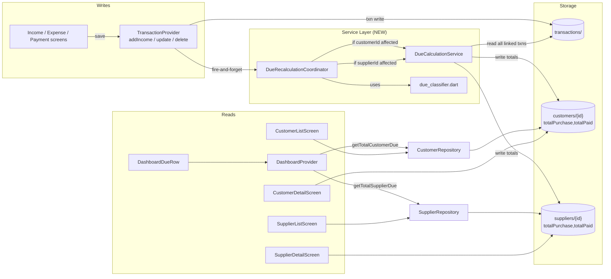
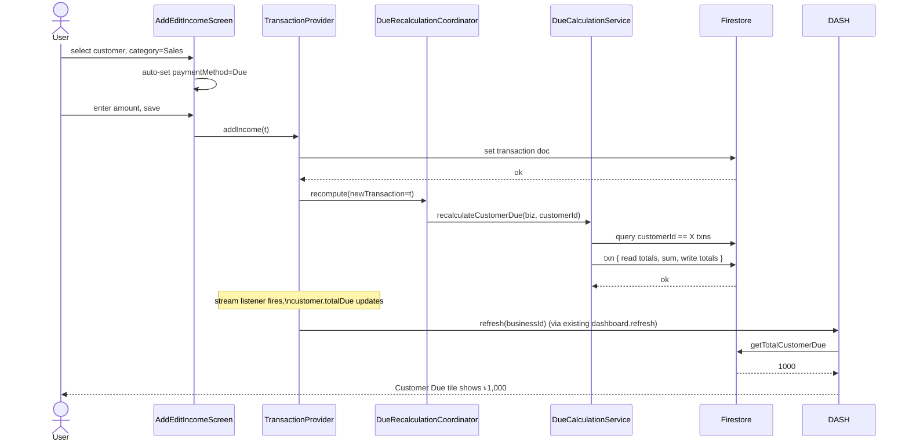

## Plan: Fix Customer and Supplier Due Functionality

**TL;DR** The dashboard, list screens, and detail screens all already render Customer/Supplier Due tiles and headers, but the underlying `Customer.totalPurchase` / `Supplier.totalPurchase` fields are never updated when a credit-sale or credit-purchase transaction is added/edited/deleted through `TransactionProvider`. As a result, dashboard dues always display ৳0. This plan adds a `DueCalculationService` that recalculates totals from the source-of-truth transactions on every write, auto-classifies credit transactions with the `Due` payment method, validates payment amounts, and exercises the existing dashboard / list / detail wiring so balances reflect immediately.

**Why the dashboard is "wired but always zero"**

| Component | State |
|---|---|
| `DashboardDueRow` widget | ✅ Renders customer/supplier due tiles, tap → list screen |
| `DashboardRepository.getTotalCustomerDue / getTotalSupplierDue` | ✅ Delegates to repository |
| `CustomerRepository.getTotalCustomerDue` | ✅ Sums `customer.totalDue` from Firestore |
| `Customer.totalDue` getter | ✅ Returns `totalPurchase - totalPaid` |
| `Customer.totalPurchase` updated on credit-sale txn | ❌ Never updated (always 0) |
| `TransactionModel.paymentMethods` includes `'Due'` | ❌ Missing — credit sales can't be tagged |
| `TransactionProvider.addIncome/update/delete` recalc dues | ❌ No hook |

Closing the loop on the last three rows fixes everything else automatically because all the read paths already exist.

---

**Steps**

1. **Canonical lists** — Edit `lib/models/transaction.dart`:
   - Add `'Due'` to `paymentMethods`. Insert it at the **start** so it's the default selection for the new credit-sale path (or insert at position 1 after `'Cash'` if preserving the "default cash" pattern for non-credit screens is important — final decision is to **insert after `'Cash'`** so non-credit income/expense flows keep their existing default).
   - Add `'Supplier Payment'` to `expenseCategories` (insert at position 1 after `'Purchase'` to keep the most-used categories at the top).
   - Add `'Customer Payment'` is already in `incomeCategories`. No change.

   (depends on nothing — foundational)

2. **`DueCalculationService`** — New file `lib/services/due_calculation_service.dart`. Pure Firestore I/O (no Provider dep) so it can be unit-tested with a fake repository:
   ```dart
   abstract class DueDataSource {
     Future<List<TransactionModel>> fetchTransactionsForCustomer({
       required String businessId,
       required String customerId,
     });
     Future<List<TransactionModel>> fetchTransactionsForSupplier({
       required String businessId,
       required String supplierId,
     });
     Future<void> writeCustomerTotals({
       required String businessId,
       required String customerId,
       required double totalPurchase,
       required double totalPaid,
     });
     Future<void> writeSupplierTotals({
       required String businessId,
       required String supplierId,
       required double totalPurchase,
       required double totalPaid,
     });
   }

   class DueCalculationService {
     final DueDataSource _dataSource;

     DueCalculationService({DueDataSource? dataSource})
         : _dataSource = dataSource ?? _DefaultDueDataSource();

     /// Recalculates `totalPurchase` and `totalPaid` for [customerId] from
     /// the transaction ledger. Uses Firestore transactions so reads + writes
     /// are atomic and concurrent writes can't lose updates.
     ///
     ///   totalPurchase = Σ(income t where customerId == customerId
     ///                            && paymentMethod == 'Due')
     ///   totalPaid     = Σ(income t where customerId == customerId
     ///                            && category == 'Customer Payment')
     Future<void> recalculateCustomerDue({
       required String businessId,
       required String customerId,
     });

     /// Recalculates `totalPurchase` (purchases) and `totalPaid` for
     /// [supplierId].
     ///
     ///   totalPurchase = Σ(expense t where supplierId == supplierId
     ///                            && paymentMethod == 'Due')
     ///   totalPaid     = Σ(expense t where supplierId == supplierId
     ///                            && category == 'Supplier Payment')
     Future<void> recalculateSupplierDue({
       required String businessId,
       required String supplierId,
     });
   }
   ```
   - Default `_DefaultDueDataSource` wraps `FirebaseFirestore.instance` and `FirestoreService` exactly like the existing repositories.
   - Wrap the read + write in `_firestore.runTransaction((txn) async { ... })` so concurrent writes are safe.
   - Skip the write when the recomputed totals match the stored values (avoids spurious `updatedAt` bumps that would re-trigger stream listeners on customer/supplier docs).

   (depends on 1)

3. **`DueRecalculationCoordinator`** — New file `lib/services/due_recalculation_coordinator.dart`:
   ```dart
   class DueRecalculationCoordinator {
     final DueCalculationService _service;

     /// Call after any transaction write. Decides which (if any) due
     /// totals need to be recalculated based on the new and old transaction
     /// states. Always uses the *post-write* values for the decision tree
     /// since we never trust the in-memory state to match Firestore.
     ///
     /// Rules:
     ///   * New customerId present + due-affecting category → recalc customer
     ///   * Old customerId present + due-affecting category → recalc old customer
     ///   * New supplierId present + due-affecting category → recalc supplier
     ///   * Old supplierId present + due-affecting category → recalc old supplier
     ///
     /// `dueAffectingCategory` matches the user spec:
     ///   * income + category == 'Sales' + paymentMethod == 'Due'  → customer
     ///   * income + category == 'Customer Payment'                → customer
     ///   * expense + category == 'Purchase' + paymentMethod == 'Due' → supplier
     ///   * expense + category == 'Supplier Payment'               → supplier
     Future<void> recompute({
       required TransactionModel newTransaction,
       TransactionModel? previousTransaction,
     });
   }
   ```
   - Coordinator is a singleton (no state). Constructed once in `TransactionProvider` and reused.
   - Errors are swallowed (`debugPrint`) — totals are best-effort and should never block the primary write.

   (depends on 2)

4. **Hook into `TransactionProvider`** — Edit `lib/providers/transaction_provider.dart`:
   - Add `final DueRecalculationCoordinator _dueCoordinator = DueRecalculationCoordinator();`
   - After every successful write in `addIncome`, `updateIncomeModel`, `deleteIncome`, `addExpense`, `updateExpenseModel`, `deleteExpense` → fire-and-forget `_dueCoordinator.recompute(newTransaction: t, previousTransaction: prev)`.
   - For deletes, pass `previousTransaction: t` and `newTransaction: <empty model>` (or a dedicated `recomputeAfterDelete(TransactionModel removed)` overload — pick whichever is cleaner; recommend a dedicated overload so the "new" state is unambiguously empty).
   - Public method on the provider: `Future<void> recomputeCustomerDue(businessId, customerId)` and the supplier mirror — useful for the dashboard to force a refresh after a manual customer delete, and for tests.

   (depends on 3)

5. **Auto-classification helpers** — New file `lib/features/transactions/due_classifier.dart`:
   ```dart
   /// Returns true when the transaction affects a customer's due balance.
   bool isCustomerDueAffecting(TransactionModel t) =>
       t.customerId != null && t.customerId!.isNotEmpty &&
       ((t.type == TransactionType.income &&
           t.category == 'Sales' &&
           t.paymentMethod == 'Due') ||
        (t.type == TransactionType.income &&
            t.category == 'Customer Payment'));

   /// Returns true when the transaction affects a supplier's due balance.
   bool isSupplierDueAffecting(TransactionModel t) =>
       t.supplierId != null && t.supplierId!.isNotEmpty &&
       ((t.type == TransactionType.expense &&
           t.category == 'Purchase' &&
           t.paymentMethod == 'Due') ||
        (t.type == TransactionType.expense &&
            t.category == 'Supplier Payment'));
   ```
   - Used by the coordinator AND by the income/expense screens for UI hints.

   (depends on 1)

6. **Income form auto-classification** — Edit `lib/features/income/add_edit_income_screen.dart`:
   - When the user selects a customer and the category is `'Sales'`, force `paymentMethod = 'Due'` (override their selection with a one-line `setState`). Show a small hint chip "Recorded as credit sale — customer due will update."
   - When the user selects a customer and the category is `'Customer Payment'`, keep their chosen payment method but default to `'Cash'` if it was unset.
   - When the user clears the customer, allow any payment method (cash sale that happens to involve a known customer).

   (depends on 5)

7. **Expense form mirror** — Same change in `lib/features/expense/add_edit_expense_screen.dart` for `supplier` + `'Purchase'` → `'Due'`, and `supplier` + `'Supplier Payment'` → default `'Cash'`.

   (depends on 5)

8. **Payment validation** — Edit `lib/features/customers/record_payment_screen.dart`:
   - **Block** submission when `amount > customer.totalDue`. The current UI shows a warning card but the `_submit` function does NOT enforce it (it will happily save an over-payment). Add an early-return in `_submit`:
     ```dart
     if (amount > customer.totalDue) {
       _showError(
         'Payment cannot exceed the outstanding due of '
         '${CurrencyFormatter.format(customer.totalDue)}.',
       );
       return;
     }
     ```
   - Filter `_paymentMethod` options to exclude `'Due'` (payments can't be on-due payments). Same change for `record_supplier_payment_screen.dart`.

   (depends on nothing — uses existing data)

9. **Detail screens** — Verify `lib/features/customers/customer_detail_screen.dart` and `lib/features/suppliers/supplier_detail_screen.dart`:
   - Confirm they call `transactionRepository.streamTransactions(businessId).where(t => t.customerId == id)` (and supplier mirror) — must be businessId-scoped so user A cannot see user B's transactions even if customerIds collided.
   - Confirm totals displayed match `customer.totalPurchase` and `customer.totalPaid` (these will start being correct after step 4 ships).
   - Add a "Payment History" tab that uses `customerRepository.streamPayments` (already wired).
   - Add the same separation for suppliers using `supplierRepository.streamSupplierPayments`.
   - No structural rewrites expected — only fixes if existing screens hard-code something broken.

   (depends on 1, 2)

10. **Dashboard refresh path** — Already covered by existing `dashboard.refresh(businessId)` calls in `record_payment_screen`, `add_edit_income_screen`, and `add_edit_expense_screen`. After step 4, the customer/supplier `totalDue` stream updates the dashboard automatically because the dashboard listens to the repository's `getTotalCustomerDue / getTotalSupplierDue` once on load — but it doesn't stream. Add a one-time `refresh()` call in the screens after each write (already exists in record_payment_screen; verify in add_edit_income_screen and add_edit_expense_screen).

    (depends on 4)

11. **Firestore rules** — Edit `firestore.rules`:
    - For `businesses/{businessId}/customers/{customerId}`: prevent direct client writes to `totalPurchase`, `totalPaid`, `totalDue` (the field is computed by the service layer). Use `request.resource.data.diff(resource.data).affectedKeys().hasOnly([...allowedFields...])` — or, simpler, allow the service layer to run via a callable Cloud Function and block the field entirely on client writes.
    - For suppliers: mirror rule.
    - For transactions: prevent direct writes to existing credit transactions if they have a `customerId`/`supplierId` (forces all edits through the service layer). Looser version: allow edits but trust the service layer to keep totals consistent (recommended for v1 to avoid breaking the existing income/expense edit screens).

    (depends on 4)

12. **Tests** — New file `test/due_calculation_service_test.dart` (and optionally `test/due_recalculation_coordinator_test.dart`):
    - Use a `FakeDueDataSource` that records calls and returns canned transactions.
    - Cases (covering the spec's 22 scenarios + 21 edge cases, condensed):
      1. Empty customer history → totals `(0, 0)`.
      2. Single credit sale → `(amount, 0)`.
      3. Single customer payment → `(0, amount)`.
      4. Multiple sales + payments → correct sums.
      5. Cash sale (paymentMethod ≠ 'Due') with customerId → does NOT affect totals.
      6. Service income with customerId → does NOT affect totals.
      7. Mixed customer A + customer B → each gets their own totals.
      8. Delete a transaction → subsequent recalc omits it.
      9. Edit a transaction amount → totals reflect new value.
      10. Reassign customerId from A to B → A's totals decrement, B's increment (covers `previousTransaction` path).
      11. Business isolation: never reads/writes across businessIds.
      12. Concurrent recalcs for the same customer → all complete without throwing (Firestore txn handles locking; here we verify the service is re-entrant).
      13. Zero-amount transaction → ignored.
      14. Negative-amount transaction → treated as zero (defensive).
      15. Customer deleted between read and write → write skipped gracefully (no exception bubbles).
      16. Supplier mirror of all the above (16 mirrored cases).
      17. Coordinator: edit that changes amount → both old and new entity are recalculated if customerId changed; only the new entity if just amount changed.
      18. Coordinator: delete with due-affecting category → single entity recalc.
      19. Coordinator: delete with non-due-affecting category → no recalc.
      20. Coordinator: insert with no due impact → no recalc.
      21. Classifier: `isCustomerDueAffecting` returns true only for the two documented shapes.
      22. Classifier: `isSupplierDueAffecting` returns true only for the two documented shapes.
    - Existing widget_test.dart failures (`CurrencyFormatter formatWithSign`, `TransactionModel payment methods exist`, `Validators mobile number validator`) will need attention in step 12:
      - `TransactionModel payment methods exist` — already passes since `'Due'` is being added to the list; **no change needed** to widget_test.
      - The other two remain broken (pre-existing) — leave them.

    (depends on 1–9)

13. **Verification** —
    - `flutter analyze` → 0 issues.
    - `flutter test` → +30 + new tests pass; the 3 pre-existing widget_test failures stay broken (they're documented in the prior summary).
    - Manual: launch app → add a customer → record a credit sale of ৳1000 (category=Sales, paymentMethod=Due, customerId=X) → dashboard "Customer Due" shows ৳1000 → record a payment of ৳400 (record_payment_screen) → dashboard shows ৳600 → edit the payment to ৳500 → dashboard shows ৳500 → delete the payment → dashboard shows ৳1000 again. Repeat for supplier side.

---

**Relevant files**
- `lib/models/transaction.dart` — add `'Due'` to paymentMethods and `'Supplier Payment'` to expenseCategories.
- `lib/services/due_calculation_service.dart` — NEW. Core recalc logic.
- `lib/services/due_recalculation_coordinator.dart` — NEW. Decides which recalcs to run.
- `lib/features/transactions/due_classifier.dart` — NEW. Pure functions used by coordinator + screens.
- `lib/providers/transaction_provider.dart` — wire coordinator into all 6 write methods.
- `lib/features/income/add_edit_income_screen.dart` — auto-classify credit sales.
- `lib/features/expense/add_edit_expense_screen.dart` — auto-classify credit purchases.
- `lib/features/customers/record_payment_screen.dart` — enforce amount ≤ totalDue, hide `'Due'` payment method.
- `lib/features/suppliers/record_supplier_payment_screen.dart` — mirror change.
- `lib/features/customers/customer_detail_screen.dart` — verify transaction history uses businessId scope.
- `lib/features/suppliers/supplier_detail_screen.dart` — mirror.
- `firestore.rules` — restrict direct client writes to `totalPurchase`/`totalPaid`/`totalDue`.
- `test/due_calculation_service_test.dart` — NEW. ~22 tests.
- `test/due_recalculation_coordinator_test.dart` — NEW. ~6 tests.

---

**Diagrams**

```mermaid
erDiagram
  TRANSACTIONS ||--o{ CUSTOMERS : "customerId (income)"
  TRANSACTIONS ||--o{ SUPPLIERS : "supplierId (expense)"
  CUSTOMERS ||--|| CUSTOMERS_TOTALS : "totalPurchase, totalPaid"
  SUPPLIERS ||--|| SUPPLIERS_TOTALS : "totalPurchase, totalPaid"

  TRANSACTIONS {
    string id PK
    string businessId FK
    string type "income|expense"
    double amount
    string category "'Sales'|'Customer Payment'|'Purchase'|'Supplier Payment'|..."
    string paymentMethod "'Cash'|'Due'|'Bank'|..."
    string customerId FK "nullable"
    string supplierId FK "nullable"
  }
  CUSTOMERS {
    string id PK
    string businessId FK
    double totalPurchase "Σ credit sales"
    double totalPaid "Σ customer payments"
    double totalDue "computed: totalPurchase - totalPaid"
  }
  SUPPLIERS {
    string id PK
    string businessId FK
    double totalPurchase "Σ credit purchases"
    double totalPaid "Σ supplier payments"
    double totalDue "computed: totalPurchase - totalPaid"
  }
```







---

**DO-NOT-TOUCH list (per user spec)**
- OTP / BdApps / Auth / Subscription screens — untouched.
- Dashboard core layout — only refresh hooks added (no UI reshuffling).
- Income/Expense form structure — only auto-classification logic added (no field renames, no flow rewrites).
- Reports module — untouched.
- AI module — untouched.
- Firestore rules outside the customer/supplier `totalPurchase`/`totalPaid` field restrictions — untouched.

---

**Verification**
1. `flutter analyze` → 0 issues (whole project).
2. `flutter test test/due_calculation_service_test.dart test/due_recalculation_coordinator_test.dart` → all new assertions pass.
3. `flutter test` → +30 + new tests pass; the 3 pre-existing widget_test failures remain broken (documented as pre-existing).
4. Manual smoke test the dashboard "Customer Due" and "Supplier Due" tiles after creating credit-sale and credit-purchase transactions — numbers must update immediately.
5. Manual smoke test record-payment validation: try to pay ৳5000 against a customer with ৳3000 due → must be rejected with the friendly error.
6. Business isolation smoke: user A's customer cannot be referenced from user B's transaction (Firestore rules already enforce; verify with two emulator users).