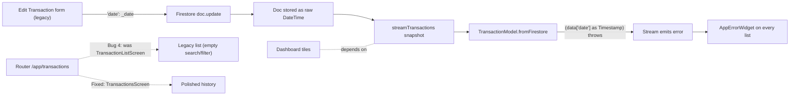
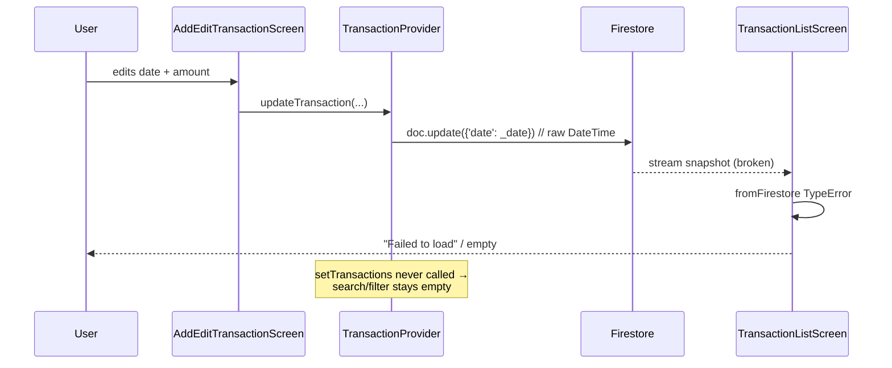

## Plan: Fix all customer and transaction bugs

**TL;DR:** The Customer + Transaction features fail at runtime due to a cluster of bugs. The most destructive one is `add_edit_transaction_screen.dart` writing a raw `DateTime` instead of a Firestore `Timestamp` for the `date` field on edits — a single bad doc poisons every transaction stream. The other bugs compound it: legacy list screens never push stream data into providers, models throw on non-Timestamp dates, and the bottom-nav routes to a legacy screen instead of the polished history screen. This plan covers every fix in one pass.

**Steps**

1. **Bug 1 (root cause) — Stop writing raw `DateTime` in the legacy edit transaction screen.** In `lib/features/transactions/add_edit_transaction_screen.dart`, add `import 'package:cloud_firestore/cloud_firestore.dart';` and change line 67 `'date': _date` → `'date': Timestamp.fromDate(_date)`. After this, no new bad-date docs will be written.

2. **Bug 2 (defensive read) — Add a `readDate` helper to all three model classes that cast timestamps.** Replace every `(data['x'] as Timestamp).toDate()` with a helper that accepts `Timestamp`, `DateTime`, ISO `String`, and `int` epoch ms so legacy broken docs still deserialize instead of crashing the stream. Apply to `lib/models/transaction.dart`, `lib/models/customer.dart`, and `lib/models/customer_payment.dart`.

3. **Bug 3 — Push stream snapshots into `TransactionProvider` from the legacy list screen.** In `lib/features/transactions/transaction_list_screen.dart`, the `StreamBuilder` currently never calls `provider.setTransactions(...)`. The surrounding search/filter UI reads `provider.transactions` (empty). Add the same postFrameCallback pattern already used in `customer_list_screen.dart`.

4. **Bug 4 — Repoint the bottom-nav `/app/transactions` route at the polished history screen.** In `lib/router.dart` line 111, change the builder from `const TransactionListScreen()` to `const TransactionsScreen()`. The polished screen already has the summary header, date presets, type segment, category chips, and pagination; the legacy one is dead weight.

5. **Bug 5 (optional polish) — Eliminate the brief "No customers yet" flicker on the customer list.** In `lib/features/customers/customer_list_screen.dart`, replace the StreamBuilder-with-postFrameCallback with a `StreamSubscription` started in `initState` so `setCustomers` runs once per snapshot instead of being scheduled from inside a builder. Skip if scope is "critical only".

6. **Verification — run `flutter analyze` + manual smoke test.** Add a transaction, edit it, confirm the history list still renders. Add a customer, confirm the list populates without flicker. Record a payment, confirm the dashboard's Customer Due tile updates.

**Relevant files**
- `lib/features/transactions/add_edit_transaction_screen.dart` — add Firestore import, wrap date as Timestamp.
- `lib/models/transaction.dart` — add `static DateTime readDate(Object?)` and replace 3 casts.
- `lib/models/customer.dart` — same helper applied to `createdAt` / `updatedAt`.
- `lib/models/customer_payment.dart` — same helper applied to `date` / `createdAt`.
- `lib/features/transactions/transaction_list_screen.dart` — push stream snapshots into `TransactionProvider.setTransactions`.
- `lib/router.dart` — repoint `/app/transactions` to `TransactionsScreen`.
- `lib/features/customers/customer_list_screen.dart` — (optional) use `StreamSubscription` in `initState` to remove flicker.

**Diagrams**

**Verification**
1. `flutter analyze` → zero new issues.
2. Manual: add a transaction via the polished screen → appears in History within one second.
3. Manual: edit a transaction's date in the legacy screen → list still renders, no error overlay.
4. Manual: add a customer → list populates, no flicker, due tile stays accurate.
5. Manual: record a payment → dashboard "Customer Due" tile reflects the new balance.
