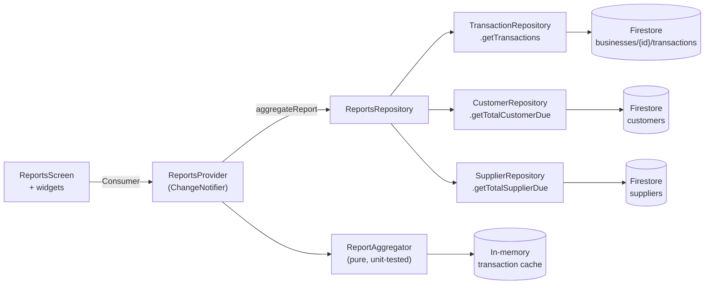
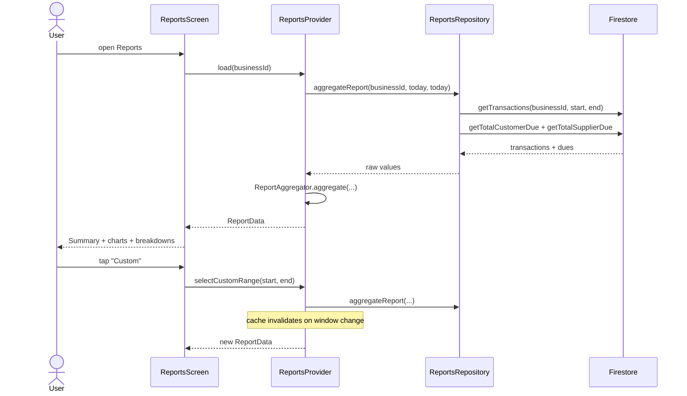
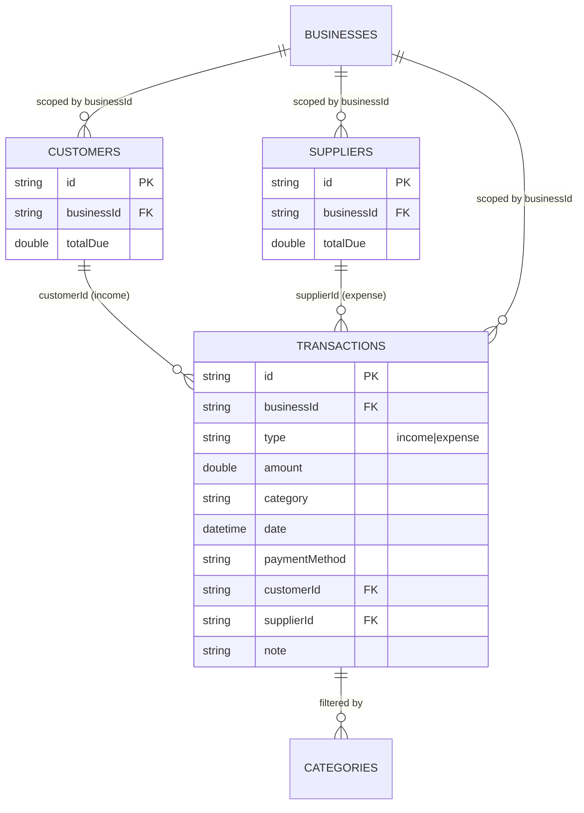

## Plan: Reports and Analytics

**TL;DR** Build a production-grade Reports module: a `ReportsProvider` that owns a `ReportData` snapshot, fetches transactions in the chosen window via the existing `TransactionRepository.getTransactions`, computes income/expense/profit/category splits locally once, and renders them in a 4-tab screen with summary cards, four `fl_chart` visualisations, breakdowns, and category filters. Customer/Supplier due tiles reuse `CustomerRepository.getTotalCustomerDue` / `SupplierRepository.getTotalSupplierDue` (they already encode today's outstanding balances; surfaced with an "as of today" caption).

**Steps**

1. **Carrier models** — Add `lib/features/reports/models/report_data.dart`:
   - `ReportPeriod` enum (`daily`, `weekly`, `monthly`, `custom`) + label helpers.
   - `ReportCategoryTotal { String category; double amount; int count; }`.
   - `ReportBucket { DateTime label; double income; double expense; }` (one row per day of the window — drives the Profit-Trend line chart).
   - `ReportData` immutable carrier: `period`, `start`, `end`, `totalIncome`, `totalExpense`, `netProfit`, `transactionCount`, `customerDue`, `supplierDue`, `incomeByCategory: List<ReportCategoryTotal>`, `expenseByCategory: List<ReportCategoryTotal>`, `trendBuckets: List<ReportBucket>`, `selectedCategory` (nullable filter), `categoryOptions: List<String>` (union of expense/income categories present in the window).
   - Computed getters: `profitMargin`, `isEmpty`, `hasIncome`, `hasExpense`.
   (depends on 2)

2. **`ReportsProvider`** — `lib/providers/reports_provider.dart` extending `ChangeNotifier`:
   - Constructor takes optional `TransactionRepository`, `CustomerRepository`, `SupplierRepository` (defaults to fresh instances — same DI pattern as `DashboardProvider`).
   - State: `ReportPeriod _period`, `DateTime _start`, `DateTime _end`, `String? _selectedCategory`, `ReportData? _data`, `bool _isLoading`, `bool _isRefreshing`, `String? _errorMessage`.
   - Public API:
     - `selectPeriod(ReportPeriod)` — recomputes the date window via `DateRangeResolver.resolve(period)`, resets `selectedCategory`, then calls `load()`.
     - `selectCustomRange(DateTime, DateTime)` — same flow with the custom window.
     - `selectCategory(String?)` — re-aggregates in-place **without** re-fetching transactions (the source list is cached for the session — see step 4 perf note).
     - `load()` / `refresh()` — first load shows full-screen skeleton, subsequent loads show inline spinner.
     - Getters expose immutable `ReportData?`, `isLoading`, `isRefreshing`, `errorMessage`, `clearError()`.
   - Internal helpers: `_fetchAndAggregate()` runs the four parallel queries (`Future.wait`) — transactions in range + customer due + supplier due plus `_aggregate(transactions)` (single pass) to compute totals/categories/buckets.
   - Date math helper `DateRangeResolver` in same file (or `lib/features/reports/utils/date_range_resolver.dart`) — `today` returns `[00:00, 23:59:59.999]`, `last7Days` returns the trailing 7 days ending today, `currentMonth` returns `[1st, end-of-month]`, `custom(a,b)` normalises order and clamps to today.
   (depends on 1)

3. **`ReportsRepository`** (optional thin layer at `lib/repositories/reports_repository.dart`):
   - Same role as `DashboardRepository` — a single `aggregateReport(businessId, start, end)` method that wraps `TransactionRepository.getTransactions(...)` + customer/supplier due calls. The provider can also call repositories directly; pick this layer only if it keeps the provider readable. **Decision: keep it** because the architecture diagram explicitly asks for `Dashboard/Reports Provider → Repository → Firestore` and the existing `DashboardRepository` already follows that pattern.
   (parallel with 2)

4. **Performance: cache last-fetched transactions in provider** — Add `List<TransactionModel> _cachedTransactions` and `({DateTime start, DateTime end})? _cachedRange`. Re-aggregation (category filter change, refresh while window unchanged) reuses the cached list without a Firestore round-trip. Window change clears the cache. Single `Future.wait` per load.

5. **Reusable widgets** — `lib/features/reports/widgets/`:
   - `report_summary_grid.dart` — 5-tile grid (Income, Expense, Net Profit, Customer Due, Supplier Due). Uses `SummaryMetricCard` for parity with the dashboard. Margin/profit tile shows profit-margin % below the headline number. Customer/Supplier due tiles have a small "as of today" caption (separate semantic from the date-range totals).
   - `income_vs_expense_bar.dart` — `BarChart` with two side-by-side bars per top-level bucket (just one bar pair showing income vs expense when no bucketing, or grouped bars per day when trend bucketing is on — keep simple: just one income/expense pair with two colours).
   - `profit_trend_line.dart` — `LineChart` over `ReportData.trendBuckets` (one point per day). Empty state if no data.
   - `category_donut.dart` — `PieChart` with `centerSpaceRadius` so it reads as a donut. Accepts `List<ReportCategoryTotal>` + a title (Income/Expense).
   - `category_breakdown_list.dart` — ranked list (title, amount, % bar, transaction count). Used for both Income and Expense tabs.
   - `transaction_list_tile.dart` — slim row reused in the Income/Expense tabs. Shows date, category, payment method, customer/supplier name if linked.
   - `period_selector.dart` — `SegmentedButton<ReportPeriod>` plus a "Custom" tile that opens a date-range picker dialog.
   - `category_filter_chips.dart` — horizontal `Wrap` of `FilterChip`s ("All", "Sales", "Rent", …) derived from `data.categoryOptions`. Hidden when fewer than 2 categories exist.
   - `report_loading_shell.dart` — `Shimmer.fromColors`-based skeleton mirroring the summary grid + chart cards (uses `shimmer` package which is already a dependency).
   All widgets are pure — they receive `ReportData` (or slices) and emit `onPeriodChanged` / `onCategoryChanged` callbacks. **No widget reads from the provider directly** so the screen can test composition easily.

6. **`ReportsScreen` rewrite** — replace `lib/features/reports/reports_screen.dart`:
   - `Scaffold` with `AppBar(title: 'Reports')`, `actions: [IconButton(refresh)]`.
   - `SingleChildScrollView` body (no TabBar — use sections instead, the previous 4-tab layout was noisy):
     - Sticky `PeriodSelector` at the top.
     - `CategoryFilterChips` (visible only when more than 1 category exists).
     - Loading shell → `ReportLoadingShell`; Error → `AppErrorWidget` with retry; Empty (after load with zero transactions in window) → `EmptyWidget`; ready → render summary grid + 4 chart cards + 2 breakdown lists + 2 transaction lists (collapsible under "Show all").
   - All state changes (`onPeriodChanged`, `onCustomRangePicked`, `onCategorySelected`) call the provider. Provider state drives the rebuild via `Consumer<ReportsProvider>`.
   - Pull-to-refresh: `RefreshIndicator` calling `provider.refresh(businessId)`.

7. **Wire provider into `main.dart`** — Add `ChangeNotifierProvider(create: (_) => ReportsProvider())` to the existing `MultiProvider` list (same place `DashboardProvider` is registered). No new globals.

8. **Chart polish for "not overloaded"** — Each chart card lives inside a `Card` with: header (title + trailing label like "BDT" or period range), body (chart, fixed height 200–220), footer micro-note (e.g., "+৳X vs previous period"). Skip charts entirely when their underlying data is empty to avoid `fl_chart` warnings.

9. **Export architecture (deferred plumbing)** — Add `lib/features/reports/services/report_exporter.dart` with an interface-only contract:
   ```dart
   abstract class ReportExporter {
     /// Renders the report to a platform-shareable artifact.
     /// Returns the path on disk, or null on failure. UI may show "Share" later.
     Future<String?> export(ReportData data);
   }
   ```
   Plus a no-op `StubReportExporter` that returns `null` and a `CsvReportExporter` that builds an in-memory CSV string (income rows, expense rows, summary block, customer/supplier due block) using `path_provider`-free in-memory writes. No third-party packages; if `path_provider` is needed for actual file output, it's already a transitive dep on mobile/web. **No UI export button is wired in this iteration** — the architecture is in place so an "Export" button can be added to the AppBar later without restructuring.

10. **Register route** — `lib/router.dart` already routes `/app/reports` to `ReportsScreen`. No change needed.

11. **Verification** — Add a unit-testable pure aggregator `lib/features/reports/utils/report_aggregator.dart` exposing `ReportData aggregate({ required DateTime start, required DateTime end, required List<TransactionModel> transactions, required double customerDue, required double supplierDue, String? categoryFilter })`. Then write `test/report_aggregator_test.dart` covering:
    - Daily / Weekly / Monthly windows from a fixture of 30 transactions → assert totals match a hand-computed spreadsheet (income, expense, profit, category splits).
    - Custom range with reversed dates is normalised.
    - Empty input → all-zero data, `isEmpty == true`.
    - Category filter drops out non-matching rows but preserves totals math.
    - Profit-trend buckets are exactly one per day between `start` and `end` (no gaps) with zero-filled days.
    - Customer/Supplier due pass-through unchanged by filter.
    Run `flutter test test/report_aggregator_test.dart` and `flutter analyze`.

**Relevant files**
- `lib/features/reports/reports_screen.dart` — replace (currently a 4-tab placeholder).
- `lib/features/reports/models/report_data.dart` — new carriers.
- `lib/features/reports/utils/date_range_resolver.dart` — new.
- `lib/features/reports/utils/report_aggregator.dart` — new (pure function, unit-testable).
- `lib/features/reports/widgets/*.dart` — new (8 widgets listed above).
- `lib/features/reports/services/report_exporter.dart` — new (stub + CSV).
- `lib/repositories/reports_repository.dart` — new thin aggregator.
- `lib/providers/reports_provider.dart` — new.
- `lib/main.dart` — register `ReportsProvider` in `MultiProvider`.
- `test/report_aggregator_test.dart` — new.

**Diagrams**






**Verification**
1. `flutter analyze lib/features/reports lib/providers/reports_provider.dart lib/repositories/reports_repository.dart` → 0 issues.
2. `flutter test test/report_aggregator_test.dart` → all assertions pass (daily/monthly/custom windows, empty, category filter, trend buckets, due pass-through).
3. Manual smoke: launch app → Reports → flip through Daily / Weekly / Monthly → numbers match a hand-summed spreadsheet for the seed transactions. Pick Custom and verify start ≤ end normalises.
4. Filter chip "Rent" on Expense tab → only rent rows contribute to category breakdown, totals unchanged.
5. Empty window (future date range) → empty state with a clear message, no chart warnings.
6. `flutter analyze` on the whole project → no new warnings.
